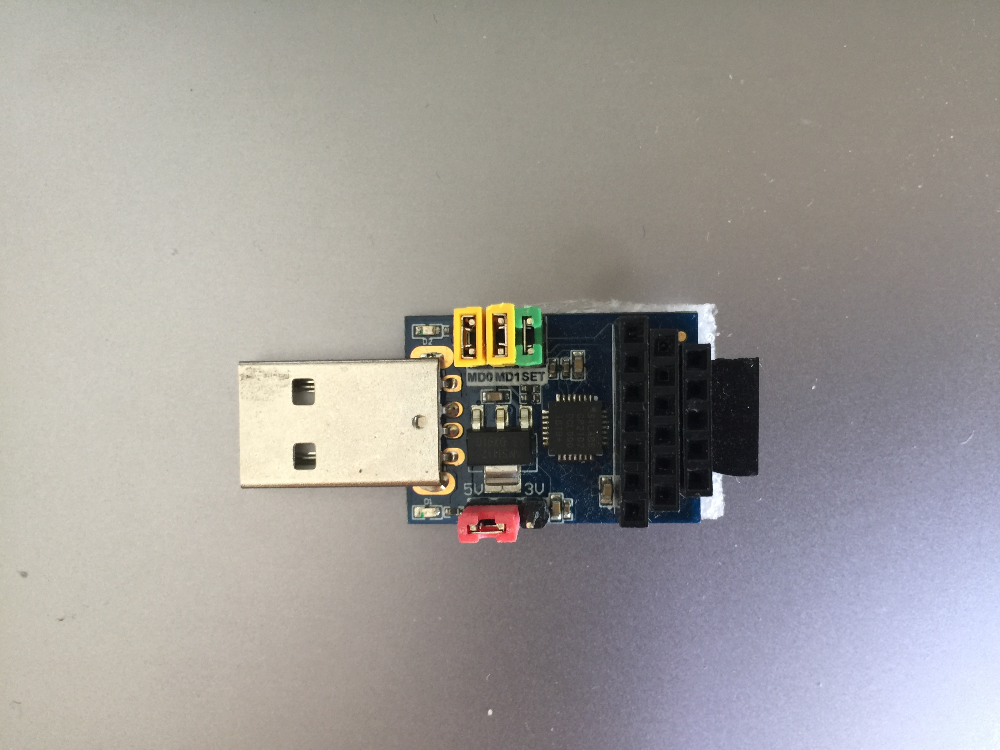
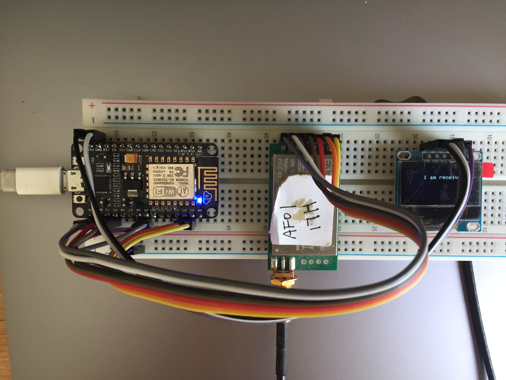
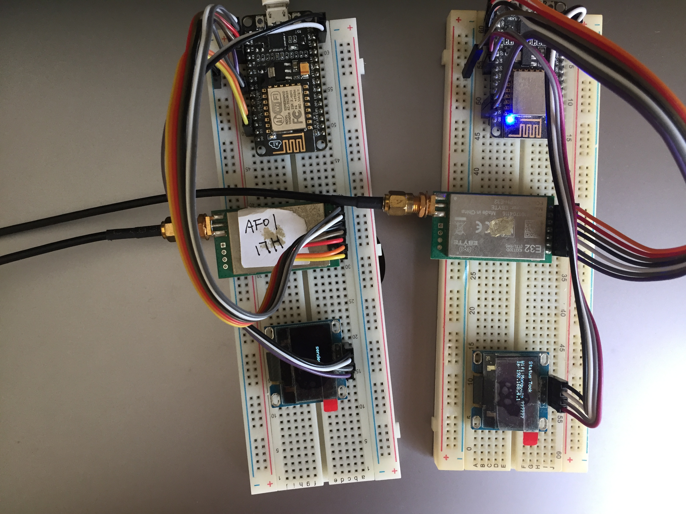

1. connect esp8266 with lora e32 module and olde 0.96 (4 pin)
    
    I2C pin: GPIO12 GPIO14 -> OLED SDA , SCL
    
    GPIO5 -> E32 pin m0

    GPIO4 -> E32 pin m1

2. e32 addr set
    
    use this module to set e32 hard params, 2 yellow pins are for work mode change 

    

    

    sender

        let e32_high_addr = 0xAF;

        let e32_low_addr = 0x01;
        
        let e32_channel = 0x17; //433 MHz

    receiver

        let e32_high_addr = 0xAF;

        let e32_low_addr = 0x02;
        
        let e32_channel = 0x17; //433 MHz

3. real
   
   
   
   left is sender, right is receiver
   
   

